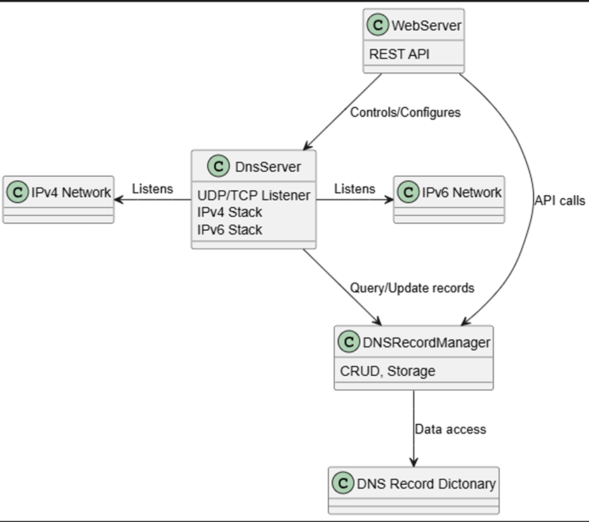

# DnsTestTool Overview

DnsTestTool is a dual-stack DNS server and client toolkit designed for testing and development. It supports both IPv4 and IPv6 traffic, allowing reliable DNS record registration, resolution, and unregistration. The project emphasizes test stability and reliability through async/await patterns, ensuring operations complete in order and tests run consistently across network stacks.

# How to start the server

1] Default run: **DualstackDnsServer.exe**

	- IPv4 will be localhost 127.0.0.1, UDP port 53 and API port 443 (HTTPS)
	- IPv6 will be localhost [::1], UDP port 53 and API port 443 (HTTPS)
	- HTTP disabled by default

2] Custom run (double-dash arguments only):

	**DualstackDnsServer.exe --ip 192.168.10.1 --ip6 fd00:10::1 --apiPort 8443 --udpPort 10053 --http true --cert "C:\mydns.local.pfx" --certPassw "P@ssw0rd!" --verbose true**

	- All arguments must use double dashes (e.g., --ip, --http, --verbose)
	- Custom IPv4 and IPv6 (**make sure custom IP address is registered on netowrk interface**)
	- Custom ports
	- Select certificate for custom IP
	- HTTP can be enabled by "--http true", will always run on port 80
	- If any parameters are not specified, default values will be used.

# Rest API tests on localhost
## IPv4 Register and resolve:

```sh
curl.exe -X POST "https://localhost:443/dns/register?domain=ip4.com&ip=192.168.10.20"
curl.exe -X POST "http://127.0.0.1:80/dns/register?domain=ip4.com&ip=192.168.10.21"
curl.exe -X POST "https://localhost:443/dns/register?domain=cpu30.local&ip=192.168.0.30"

curl.exe -X GET "https://localhost:443/dns/resolve?domain=ip4.com"
curl.exe -X GET "http://127.0.0.1:80/dns/resolve?domain=ip4.com"

curl.exe -X GET "https://localhost:443/dns/entries"
curl.exe -X GET "http://127.0.0.1:80/dns/entries"

curl.exe -X GET "https://localhost:443/dns/query?domain=ip4.com"
curl.exe -X GET "http://127.0.0.1:80/dns/query?domain=ip4.com"
curl.exe -X GET "https://localhost:443/dns/query?domain=cpu30.local."
```

## IPv6 Register and resolve:

```sh
curl.exe -X POST "https://localhost:443/dns/register?domain=ip6.com&ip=fd00:10::20"
curl.exe -g -X POST "http://[::1]:80/dns/register?domain=ip6.com&ip=fd00:10::21"
curl.exe -X POST "https://localhost:443/dns/register?domain=cpu30ipv6.local&ip=fd00::30"

curl.exe -X GET "https://localhost:443/dns/resolve?domain=ip6.com"
curl.exe -g -X GET "http://[::1]:80/dns/resolve?domain=ip6.com"

curl.exe -X GET "https://localhost:443/dns/entries"
curl.exe -g -X GET "http://[::1]:80/dns/entries"

curl.exe -X GET "https://localhost:443/dns/query?domain=cpu30ipv6.local."
```


## PowerShell syntax:

```powershell
Invoke-WebRequest -Method POST "https://localhost:443/dns/register?domain=ip6.com&ip=fd00:10::24" -UseBasicParsing
Invoke-WebRequest -Method POST "http://127.0.0.1:80/dns/register?domain=ip6.com&ip=fd00:10::25" -UseBasicParsing

Invoke-WebRequest -Uri "https://localhost:443/dns/resolve?domain=ip6.com" -UseBasicParsing
Invoke-WebRequest -Uri "http://[::1]:80/dns/resolve?domain=ip6.com" -UseBasicParsing

Invoke-WebRequest -Uri "https://localhost:443/dns/entries" -UseBasicParsing
Invoke-WebRequest -Uri "http://[::1]:80/dns/entries" -UseBasicParsing

Invoke-WebRequest -Uri "https://localhost:443/dns/query?domain=ip6.com" -UseBasicParsing
Invoke-WebRequest -Uri "http://127.0.0.1:80/dns/query?domain=ip6.com" -UseBasicParsing
```


## See DNS packets in Wireshark 
The server resolves the name internally, without using DNS protocol. No UDP packets are created.

The server now also have possibility to query real DNS packets by **/dns/query** web api (see examples above).

Therefore, resolve via nslookup (works only with port 53):

```sh
nslookup mytest1234.test. 127.0.0.1
nslookup cpu30.local. 127.0.0.1

nslookup -q=AAAA ip6.com ::1
```

> Note: `nslookup ip6.com ::1` tries both IPv4 and IPv6 when you specify `::1`.

# Architecture & Modules



---

# Enabling HTTPS

To run the server and tests with HTTPS endpoints locally, you must trust the ASP.NET Core development certificate on your machine. 

1. **Trust the ASP.NET Core development certificate (localhost):**

This allows your server to listen on `https://localhost` without browser or client warnings (For Local Development).

	Open a terminal and run:

	```sh
	dotnet dev-certs https --trust
	```

	- On Windows, this will prompt you to trust the certificate. Click 'Yes' to confirm.
	- The certificate is stored in your user profile's certificate store (not as a file in your project).
	- You can view it in the Windows Certificate Manager under `Current User > Personal > Certificates` as `ASP.NET Core HTTPS development certificate` (certmgr.msc ).   

	By default, ASP.NET Core uses this certificate for HTTPS on localhost. 

	Access your API using https://localhost (not an IP address or other hostname).

The certificate is only valid for localhost, not for 127.0.0.1 or other names.

2. **Use HTTPS with a custom hostname (e.g., mydns.local):**

   1. Generate a self-signed certificate for your hostname:
Open PowerShell as Administrator and run:

```sh
$cert = New-SelfSignedCertificate -DnsName "mydns.local" -CertStoreLocation "cert:\LocalMachine\My" -TextExtension @("2.5.29.17={text}dns=mydns.local&ipaddress=192.168.10.1&ipaddress=fd00:10::1")
$password = ConvertTo-SecureString -String "P@ssw0rd!" -Force -AsPlainText
Export-PfxCertificate -Cert $cert -FilePath "C:\mydns.local.pfx" -Password $password
```

   2. Trust the certificate:

      Open mmc.exe, add the “Certificates” snap-in for “Local Computer”.
Import the generated .pfx into “Trusted Root Certification Authorities”.

or via powershell

```sh
Export-Certificate -Cert $cert -FilePath "C:\mydns.local.cer"
Import-Certificate -FilePath "C:\mydns.local.cer" -CertStoreLocation "cert:\LocalMachine\Root"
```

   3. Add the hostname to your hosts file:

      On Windows, edit 'C:\Windows\System32\drivers\etc\hosts' and add:
127.0.0.1 mydns.local
```

   4. Start the server with arguments specifying the certificate path and password:

```sh
DualstackDnsServer.exe --cert "C:\mydns.local.pfx" --certPassw "P@ssw0rd!"
```


